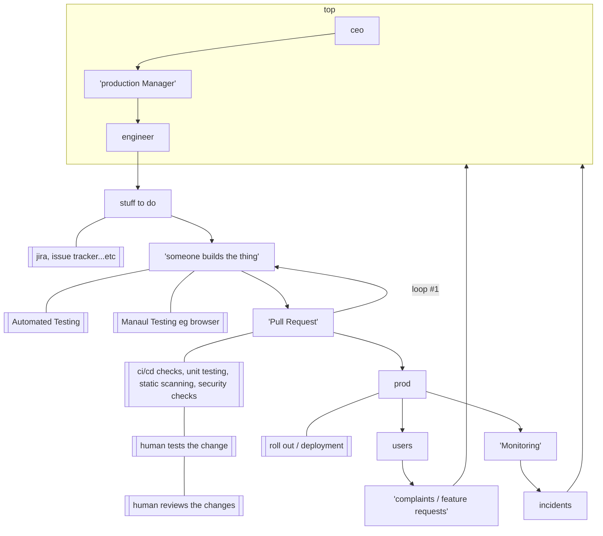
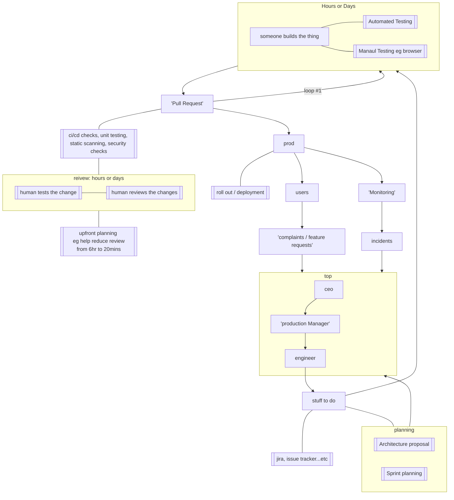
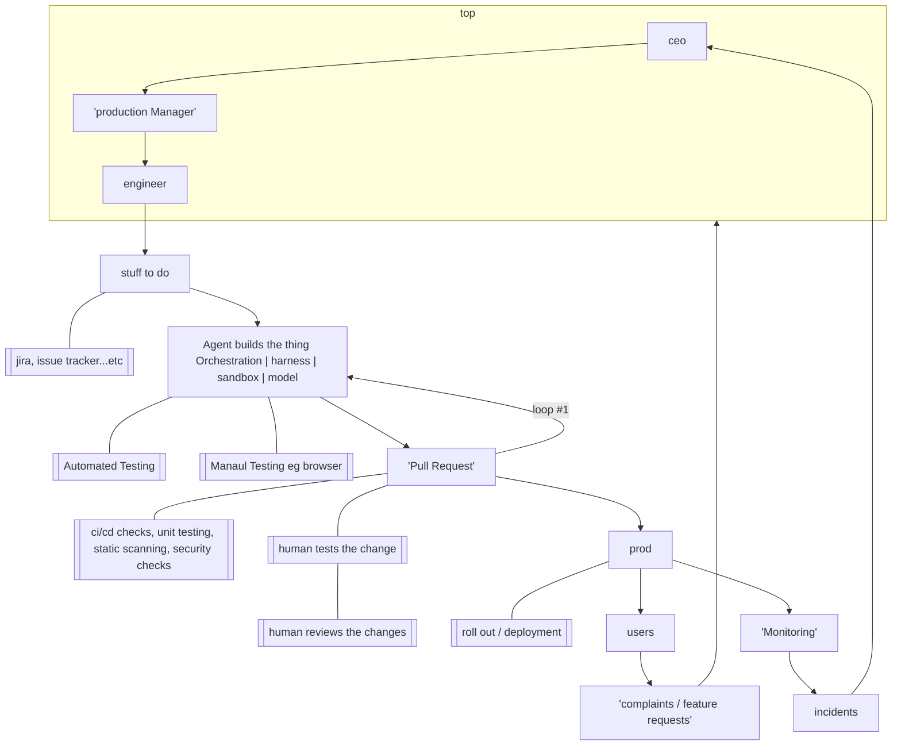

# Software Factory (Before LLM)

# Software Factory (Before LLM - to improve)

# The Agentic Software Factory
Replace the person who built the software

## Time Savingins

mermaid

flowchart TD
    subgraph top
    ceo --> prodManger["'production Manager'"]
    prodManger --> engineer
    end
    engineer --> doStuff["
        stuff to do
    "]
    doStuff --- stufNotes[[jira, issue tracker...etc ]]
    doStuff --> agentTime 
    subgraph agentTime [ Now minutes or hours ]
        agent["Agent builds the thing  Orchestration | harness | sandbox | model"]
    agent --- autoTest[[Automated Testing]]
    agent --- manualTest[[Manaul  Testing eg browser]]
    end
    agentTime --> pr["'Pull Request'"]
    pr --> |loop #1|build
    pr --- cicd[[ci/cd checks, unit testing, static scanning, security checks]]
    cicd --- humanTime
    subgraph humanTime [ STILL hours or days]
        humanTest[[human tests the change]]
        humanReview[[human reviews the changes]]
    end 
    pr --> prod
    prod --- deploy[[roll out / deployment]]
    prod --> users
    prod --> monitor["'Monitoring'"]
    users --> feedback["'complaints / feature requests'"]
    feedback --> top
    monitor --> incidents
    incidents --> ceo

